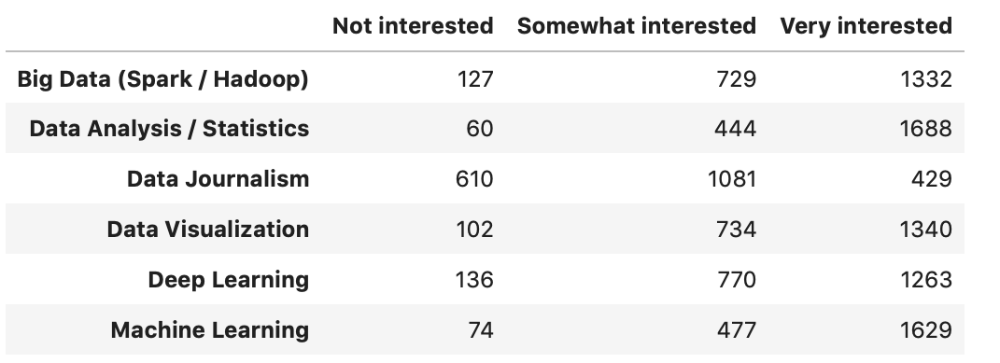
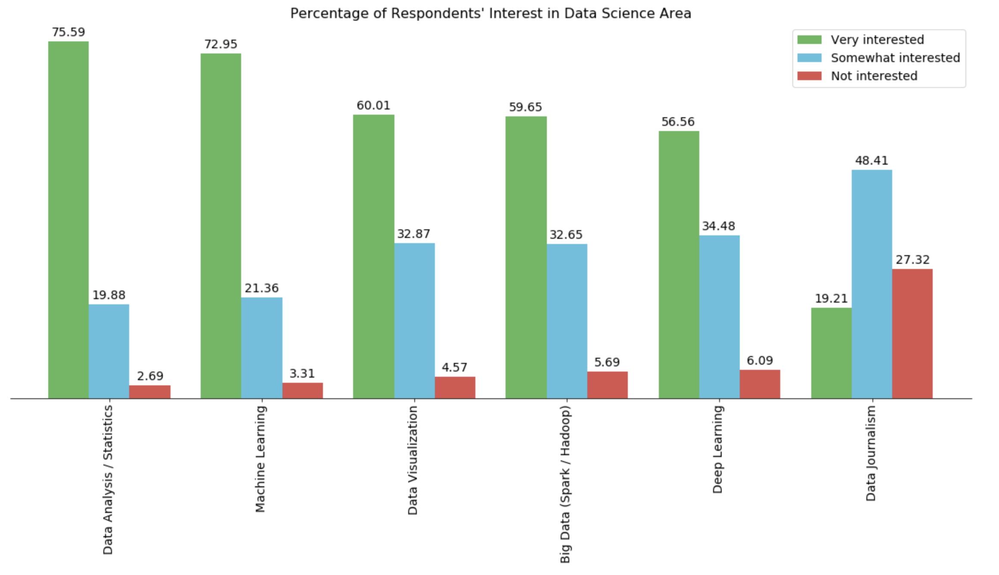
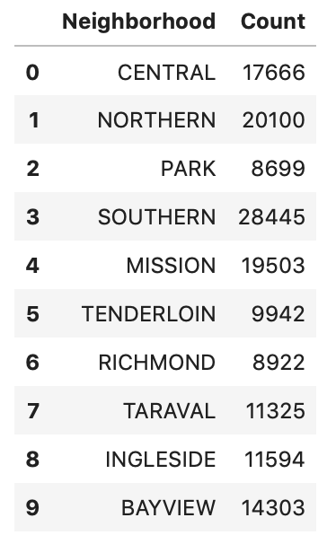

# Data Visualization Assignment

## Assignment Introduction

Data Visualization Assignment which has 4 problems covers the main topic taught in Course 5 Data Visualization of IBM specialization. Problem 1 and Problem 2 are based on a survey conducted to gauge an audience interest in different data science topics. Problem 3 and Problem 4 are extention of bar plot and choropleth map provided in the course material.

Problem 1

Problem 2

Problem 3

Problem 4

